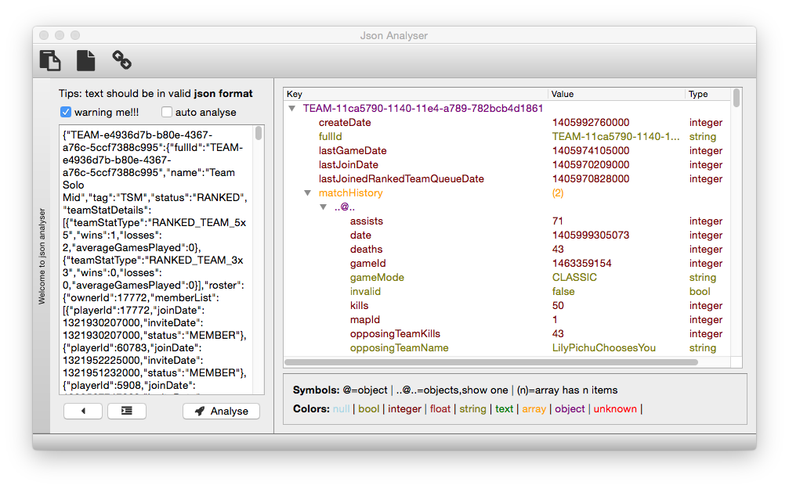

Json Analyser
====
This is a tool used for analysing json data which should be valid under windows/linux/mac os (in theory, cause it is using Qt. But i only compile it under mac os for personal usage).

Intro
----
Well, you need to compile it yourself cause i'm not very familiar with Qt deployment. So at least you need Qt Creator installed on your platform. Then check out the source from this repository, and compile/run it as you know.

Extra notice
----
It is open source, and free usage.

ChangeLog
----
Change log...

Contact
----
You could contact [me][] through <yarco.wang@gmail.com> according to further debugging or maintance. Programming related topics are also welcomed.

timezone: GMT+0800

[me]:http://bbish.net
